# AI-Dermotologist

This is a mini project that aims to build a AI classifier for deadly **skin cancer diagnose**. 

The ultimate goal is distinguish **maglignant** [Melanoma](https://www.skincancer.org/skin-cancer-information/melanoma) (a.k.a black cancer, which is one of the most deadly cancer with only 15%-20% of survival rate) from **benign lesions** such as [nevus](http://missinglink.ucsf.edu/lm/dermatologyglossary/nevus.html) and [seborrheic keratoses](https://www.aad.org/public/diseases/bumps-and-growths/seborrheic-keratoses). 

The big motivation behind this project is that if Melanoma could be detected in its *early stage*, chances of cure will be much more optimistic. However, human dermotologists are not super accurate with this diagnose and there is a shortage per capita of them. 

The training, validation and test data of this project are pulled from the [ICIC 2017: Skin Lesion Analysis Towards Melanoma Detection](https://challenge.kitware.com/#challenge/583f126bcad3a51cc66c8d9a) challenge. In addition, this [paper](https://arxiv.org/pdf/1710.05006.pdf) provides a very comprehensive review of the state of the art approaches. 

Many of the techniques implemented in this notebook are inspired by the **[RECOD Titans at ISIC Chanlenge paper](https://arxiv.org/pdf/1710.05006.pdf)**(by Menegola A, Tavares J, Fornaciali M, Li LT, Avila S, Valle E. ) including *model selections, data augmentations, evaluation and SVM meta-learner.*

Here are some samples of our data where we would find the it’s pretty hard for human eyes to classify which type is benign which is maglignant:

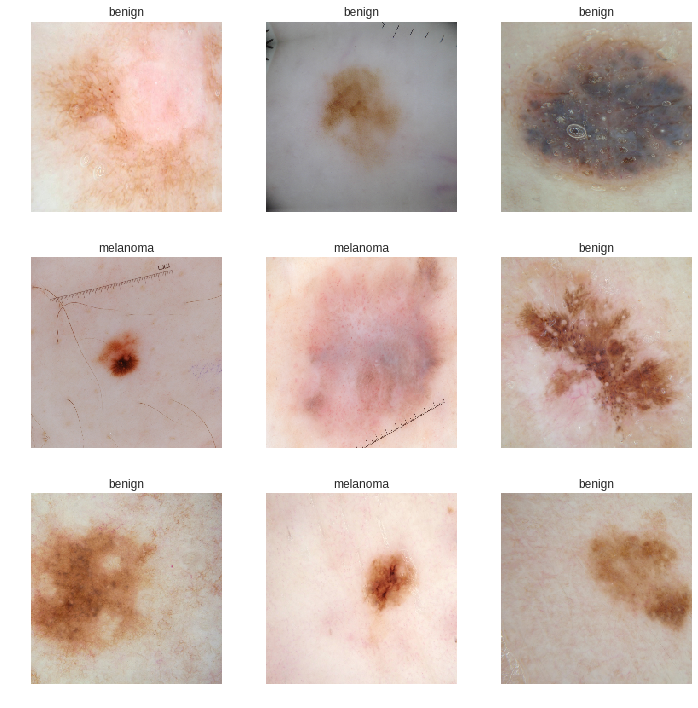

## Model architecture overview

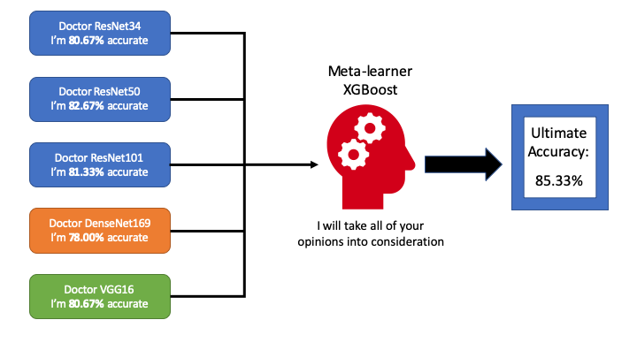

Imagine that each vision classification model we build is a doctor who can diagnose skin cancer. However, no matter how hard he tries to improve himself, he can only be so good (never 100% accurate). In the reality, we usually would have a “panel” of such doctors (each could be especially good at diagnosing certain types) to share their opinions and finally **vote** for a final decision. What could we do better?

Since each “doctor” is potentially good with certain types of skin cancer, it would make sense to value one “doctor’s” opinion than another (put different weights on their output) depending on the skin image we get. In machine learning, an good way to realise this strategy is to use a **meta-learner** that takes “doctors’” outputs as input and the ground-truth as label so that the **meta-learner** is able to learn from the “doctors” behaviours. Hence, a more educated decision could be made resulting in an accuracy higher than any individual “doctor”. For more info on **Ensemble learning** please refer to this fantastic [Medium post](https://towardsdatascience.com/ensemble-methods-bagging-boosting-and-stacking-c9214a10a205) where *bagging* and *boosting* are also introduced.

This Repo aim to demonstrate the effectiveness of modern vision deep learning techniques applied as compared to the state-of-the-art in 2017 when this dataset come out. At the same, it can seen as a guideline to use **FastAI** library as some of the important ideology of the creators of **FastAI**‘s will be explained. (Big ups.)

### Results

The metrics used in the competition is not simply accuracy but [*ORC AUC* ](https://scikit-learn.org/stable/modules/generated/sklearn.metrics.roc_auc_score.html) for each category. In order to compare to the performance with the competition participant, here we would compute the same metrics.

##### Udacity

I found the first bench mark score on [Udacity Git repo](https://github.com/udacity/dermatologist-ai):

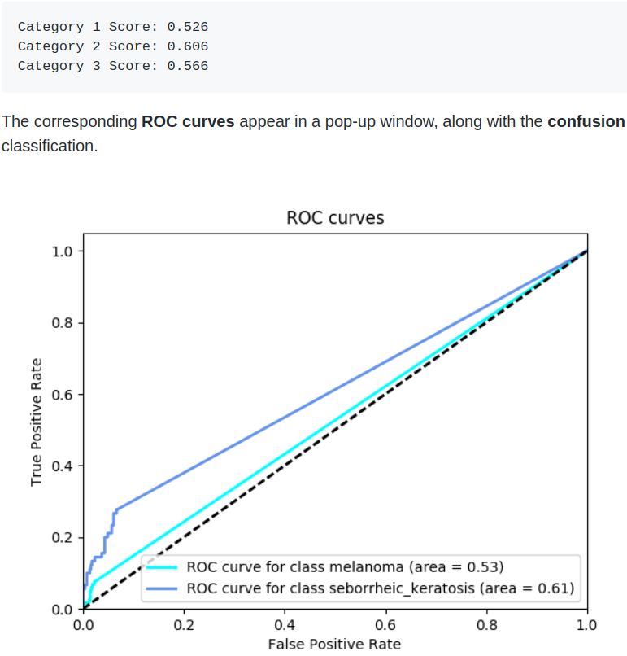

##### Best performing model

Second one is the best performing model that I can find from [online](https://github.com/macgebi/udacity-dermatologist-ai):

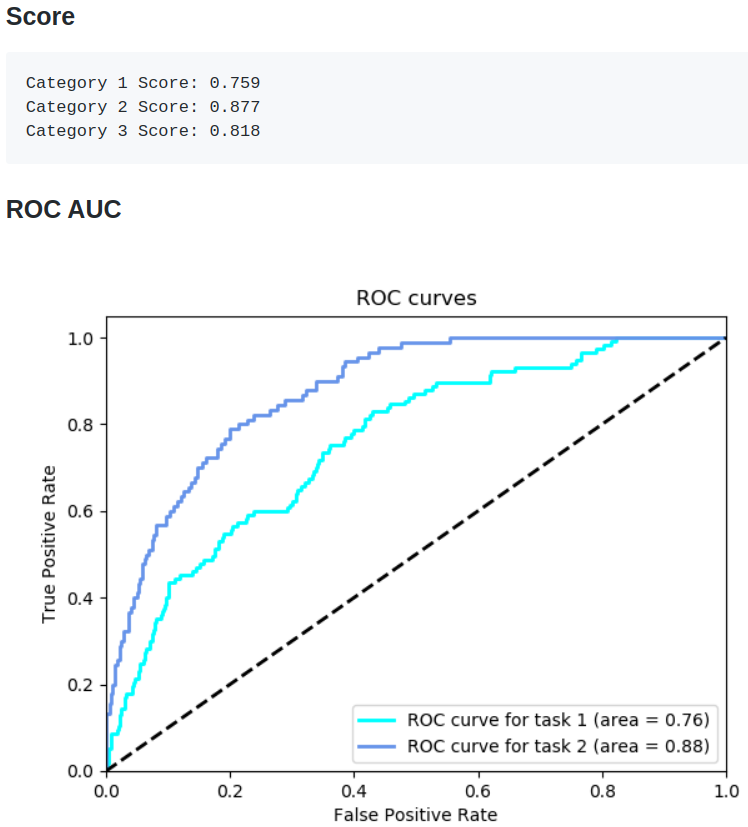

##### Our score

Finally, this what we are able to achieve with model stacking:

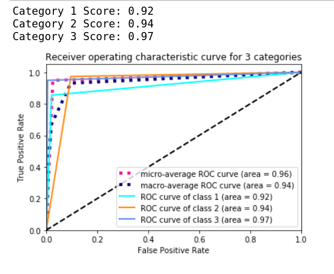

Evidently, with the more modern techniques, we are able to push the performance much further. 

Let have a look into the technique we have used to achieve this result.

## A walk through of the code

This section provides a high-level overview of the pipeline of this project as well as some of the important choice of parameters & tricks involved. Let’s begin:

### Deep learning framework

Initially, I started this project with **PyTorch** because of the flexibility it offers as well as my familiarity. Half way through the project ( around the time building the second base-model), I stumbled upon the **Fastai** library and I got superior performance in much shorter time with their tools.

This README.md will explain the main technique I have used to solve the *AI-Dermatologist* problem. At the same time, I might go out of the way and introduce some theories behind the code implementation of the fantastic **Fastai** library that made this all possible.

### sklearn

This is an obvious choice for a data-science project for data manipulation. It plays an important role in this project as we use sklearn to build our *stacking model* and *performance evaluation*.

### Pandas, hyperopt, numpy, matplotlib

Very standard libraries to use. We will get into details later.

### Pipeline

Create our dataset $\rightarrow$ data augmentation $\rightarrow$ selecting and training base-models $\rightarrow$ examine different meta-learners $\rightarrow$ selecting meta-learning and perform hyper-parameter tuning $\rightarrow$ fit and predict $\rightarrow$ apply metrics to evaluate and then repeat from step 2 

There is actually a trick we have applied to our data which is introduced by *Jeremy Howard* in his amazing [course](https://course.fast.ai/videos/?lesson=2). The same data was used effectively twice in the training which we will see later in the training section.

### Data preparation 

The data was pulled from [ICIC 2017: Skin Lesion Analysis Towards Melanoma Detection](https://challenge.kitware.com/#challenge/583f126bcad3a51cc66c8d9a) challenge. Fastai library provides a handy feature that can help us to create a [databunch](https://docs.fast.ai/basic_data.html#DataBunch) which can be readily used by the model as data-loader as well as other visualisation functions.

Trick 1: we would create **2** data-bunches. One with lower resolution, and one with higher resolutions. As we will see later, they will be used in different training stages. This trick is repeated used throughout the training process for each base vision model we aim to train.

```python
path = 'data'
bs = 64
data = ImageDataBunch.from_folder(path, ds_tfms=tfms, size=114, bs=bs
                            ).normalize(imagenet_stats)
bs = 32
data2 = ImageDataBunch.from_folder(path, ds_tfms=tfms, size=224, bs=bs
                            ).normalize(imagenet_stats)
```

We also need to specify the transformations being done to our images as the data augmentation. 

```python
# We set max_warp to 0.0 since we don't have warping in this case

tfms = get_transforms(flip_vert=True, max_rotate=180.0,max_lighting=0.2, max_zoom=1.2, max_warp=0.0)
```

#### Now let’s take a look at what we are dealing with

```python
data.show_batch(rows=4, figsize=(10,10))
```


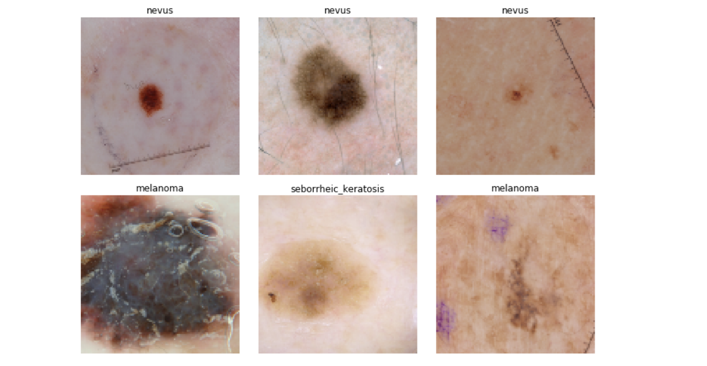

### Transfer learning

The ideology of **Fastai** is to apply transfer learning to every model that we use if possible. “why training from scratch if you can use a pre-trained model?” - Jeremy Howard

This has to do a lot with why I was able to achieve superior result as compared to building a vision model with PyTorch myself even though the two approach used the same base-architecture (ResNet 34). Of course, there are other techniques that contributed positively to the result which are applied by **Fastai** by default. Transfer learning is the big one as it greatly reduces training time and we have a good chance to train towards convergence.

At the first glance, it might not seem to be a sensible thing to do that use a CNN trained to recognising common object (such as cats and tables) to classify skin cancers. **However, in reality, the *weights* being trained to recognise common objects bring us much closer to classify skin cancer as compared to random weight.** In short, no matter in solving vision problems or NLP problem, a pre-trained model on general data should give us a positive leap towards the convergence on our dataset.

The model training strategy is as following:

* select 5 potential base-model for the dataset depending on intuitions on their suitability on this project scale.

* pre-train all of these model on COCO dataset
* train these 5 model individually to the best we can on our skin cancer dataset
* compare the commonly used machine learning model for stacking meta-learner
* identify a good meta-learner and do a hyper-parameter tuning on our dataset with 5-fold cross-validation
* train-fit-predict-evaluate

### Individual vision model training with FastAI

In standard **FastAI** pipeline, we can conveniently create a vision model with the base-architecture that we fancy, pre-train with imagenet data, associate with the `databunch` with the right data augmentation we just created, specify the monitoring metrics. All of the above done in one line, **FastAI** takes care of most of the dirty work for us:

```python
learn = cnn_learn(data, models.resnet34, metrics = accuracy)
```

#### Stage-1

Setting a good *learning_rate* is just crucial for training a good neural network model and it usually trick to find out the right *learning_rate* with just human intuition. **FastAI** also provide us a handy function that let us to take a peek at what might be a good candidate and make a educated decision.

```python
learn.lr_find()
learn.recorder.plot()
```

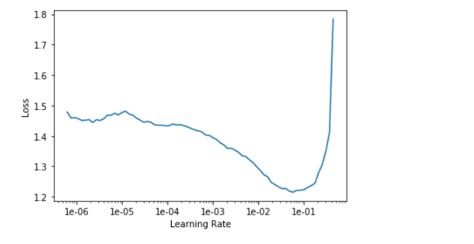

What we have to do at this point is to pick the point that has the steepest downwards slope. In this case, I would say `1e-03`.

```python
lr = 1e-3
learn.fit_one_cycle(5, slice(lr))
```

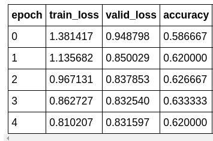

PS: what learn.[fit_one_cycle](https://docs.fast.ai/basic_train.html#fit_one_cycle) does is essentially a *learning_rate* and *momentum* scheduler which allow our network having a easier time converging to the local minima.  In short, the `learning_rate` we specified in `learn.fit_one_cycle` is actually the peak *learning_rate* and **FastAI** will figure out the rest for us.

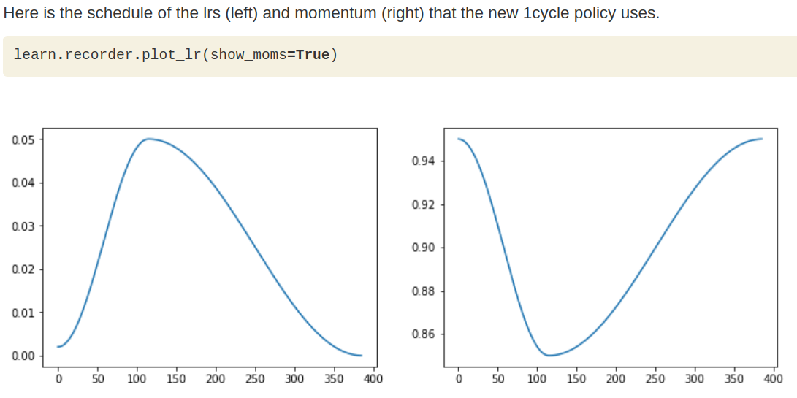

#### Stage-2

Note that by default, following the steps we have done above **FastAI** would train the model with all the weights frozen in the base-architecture (so that we are only training the *head* of the network for classification).

In Stage-2, since we have a relatively reasonable *head* to start with, it’s a good time to *unfreeze* the *body* of the `ResNet34` and train the entire network:

```python
learn.unfreeze()
learn.lr_find()
learn.recorder.plot()
```

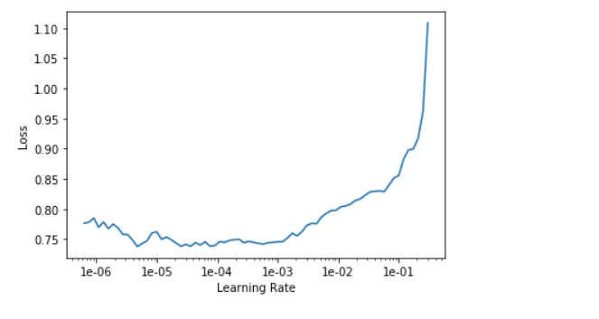

The intuition to find the good learning_rate is slightly different than stage one. In addition, we will use different learning rate for different layers as we don’t want the bottom to go crazy during training. Pick a safe learning_rate far from up inclining slope in the first slot of the `slice()` and the second slot should be filled by a number in between `lr/10` and `lr/5` depending on intuition.

````python
learn.fit_one_cycle(5, max_lr=slice(1e-5, lr/5))
````

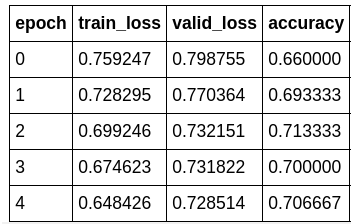

As we can see, the network still trains compared to *stage-1*. However, it kind of plateaus after a while. So, is this the best we can do?

Nope, this is where the second trick of *Jeremy Howard*‘s come in. Remember, when we create our `DataBunch` we actually create two versions. A high-resolution one and a low-resolution one. This is where they come into play. After *Stage-2* we have a model that’s pretty effective in classifying low-resolution images. What we can do at this point with our limited data is to train our model again, this time, with the high-resolution images. This might seem dumb since they actually represent the same thing. However, in the pixel level, the latter contains more information for our model to learn. Let’s seem what happens.

#### Stage-3

Here we would switch our `data_loader` and perform the training with frozen *body* weights first.

```python
learn.data = data2
learn.freeze()
learn.lr_find()
learn.recorder.plot()
```

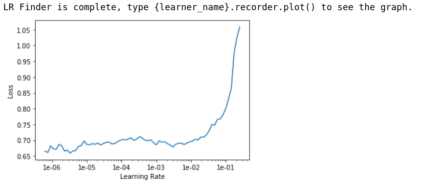

Again `1e-03` looks like a good *learning_rate* to start with.

```python
lr = 1e-3
learn.fit_one_cycle(5, lr)
```

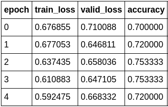

Like magic, our accuracy start to increase again.

We can also take a look at the losses when we feel like to check for any signs of over-fitting or under-fitting.

```python
learn.recorder.plot_losses()
```

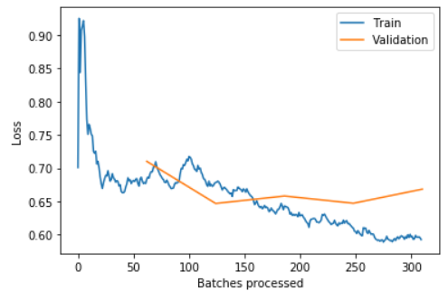

PS: the blue *training loss* is a good looking one. What we are looking for in a “healthy” training_loss is one that goes down bumps up in the middle and slowly decrease again. This phenomenon has to the with how **FasiAI** schedule the *learning_rate*.

#### Stage-4

Now you can guess what we need to do next. Yes, `unfreeze()` the weight and train the entire network.

```python
learn.unfreeze()
learn.lr_find()
learn.recorder.plot()
```

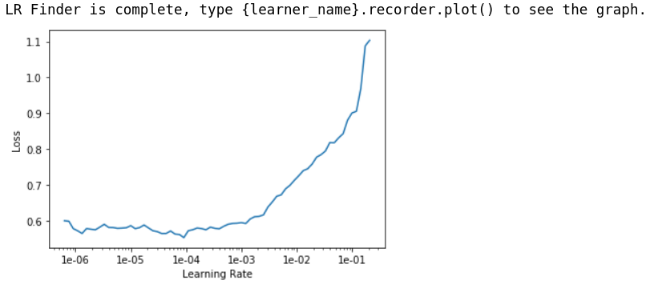

Time to pick our *learning_rates* again. After trial & error, I found that `1e-5/2` is a good *learning_rate* to use that improve the network a lot without risking diverging.

```python
learn.fit_one_cylce(5, slice(1e-5/2, lr/10))
learn.recorder.plot_losses()
learn.save('resnet34-stage-4')
```

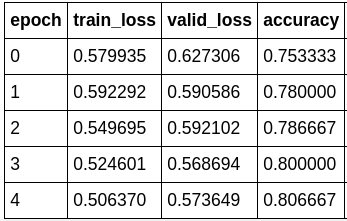

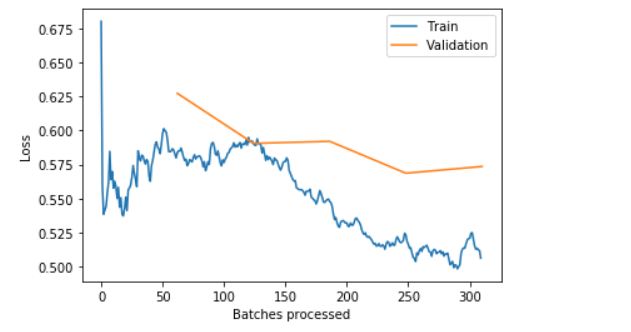

There! We have over 80% accuracy at correctly classify skin cancer from looking at images.

FYI, the model accuracy to train a `ResNet34` from scratch I was able to achieve is around 70%. After reaching 70%, the model would start to struggle with convergence and start to over-fit.

 Now, let’s take a look at the performance of our first model on the **validation data-set**:

```python
learn.show_results(ds_type=DatasetType.Train, rows=4, figsize=(8,10))
```

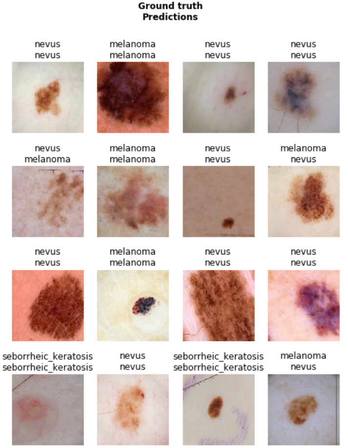

## Building other models for ensemble learning

Now that we have a well-trained `ResNet34`, let’s do the same the other base-learners that we fancy.

In this project, we picked ResNet34, ResNet50, ResNet101, DenseNet169, and the vintage VGG-16. These networks varies from depth, complexity and capacity to learn which makes it a good choice to incorporate into ensemble learning. After training them to the best of my effort, I got my base-line model accuracy as follows:

* ResNet34		-   `80.67%`
* ResNet50        -   `82.67%`
* ResNet10        -   `81.33%`
* DenseNet169 -   `78.00%`
* VGG16             -   `80.67%`

## Model stacking

Now, here comes the exciting part. We have 5 model with different weights and accuracy. What happens if we don’t use just one of the models but ask all of their opinions.

To select the best learner for our task, let’s go greedy here.

Get 20 potential candidates from commonly used machine learning methods. Test their performance with 60% data for training 30% data for validation and 10% set aside.

```python
MLA = [
#     Ensemble Methods
    ensemble.AdaBoostClassifier(),
    ensemble.BaggingClassifier(),
    ensemble.ExtraTreesClassifier(n_estimators=100),
    ensemble.GradientBoostingClassifier(),
    ensemble.RandomForestClassifier(n_estimators=100),

#     Gaussian Processes
    gaussian_process.GaussianProcessClassifier(),
    
#     GLM
    linear_model.LogisticRegression(),
    linear_model.PassiveAggressiveClassifier(),
    linear_model.RidgeClassifier(),
    linear_model.SGDClassifier(),
    linear_model.Perceptron(),
    
#     Navies Bayes
    naive_bayes.BernoulliNB(),
    naive_bayes.GaussianNB(),
    
#     Nearest Neighbor
    neighbors.KNeighborsClassifier(),
    
    #SVM
    svm.SVC(probability=True),
    svm.LinearSVC(),
    
#     Trees    
    tree.DecisionTreeClassifier(),
    tree.ExtraTreeClassifier(),
    
    #Discriminant Analysis
    discriminant_analysis.LinearDiscriminantAnalysis(),
    discriminant_analysis.QuadraticDiscriminantAnalysis(),

    
    #xgboost: http://xgboost.readthedocs.io/en/latest/model.html
    XGBClassifier(learning_rate=0.01, gamma=0.1, max_depth=2, n_estimators=500, min_child_weight=1, seed=0)    
    ]
```

```python
row_index = 0
for alg in MLA:

    #set name and parameters
    MLA_name = alg.__class__.__name__
    MLA_compare.loc[row_index, 'MLA Name'] = MLA_name
    MLA_compare.loc[row_index, 'MLA Parameters'] = str(alg.get_params())
    print(f'training etimator {row_index}, {MLA_name}')
    #score model with cross validation: http://scikit-learn.org/stable/modules/generated/sklearn.model_selection.cross_validate.html#sklearn.model_selection.cross_validate
    cv_results = model_selection.cross_validate(alg, train_df, train_y[0], cv  = cv_split,scoring='accuracy', return_train_score=True)

    MLA_compare.loc[row_index, 'MLA Time'] = cv_results['fit_time'].mean()
    MLA_compare.loc[row_index, 'MLA Train Accuracy Mean'] = cv_results['train_score'].mean()
    MLA_compare.loc[row_index, 'MLA Test Accuracy Mean'] = cv_results['test_score'].mean()   
    #if this is a non-bias random sample, then +/-3 standard deviations (std) from the mean, should statistically capture 99.7% of the subsets
    MLA_compare.loc[row_index, 'MLA Test Accuracy 3*STD'] = cv_results['test_score'].std()*3   #let's know the worst that can happen!
    
    row_index+=1

#print and sort table: https://pandas.pydata.org/pandas-docs/stable/generated/pandas.DataFrame.sort_values.html
MLA_compare.sort_values(by = ['MLA Test Accuracy Mean'], ascending = False, inplace = True)
MLA_compare
```

Here are the top 5 best performing models:

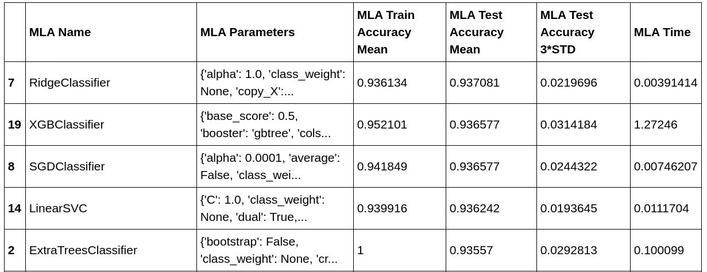

Though *Ridge classifier* also has quite good performance along with XGBoost. We would be using XGBoost here as it’s usually more robust and has high potential when we perform *hyper-parameter tuning* later.

#### Hyper-parameter tuning

Okay. What do we have right now: 5 fully trained base-line model(CNNs) and we have selected a suitable *meta-learner* among a pool of 20 learners (XGBoost).

The next step is fine-tune the *meta-learner* so that it has its best performance and then *fit* it on our data.

We will be using `hyperopt` for *hyper-parameter tuning* in this project as XGBoost has quite many hyper-parameters to tune and `hyperopt` is a *Bayesian* method that computes faster than *grid search* or *random search*.

```python
from hyperopt import space_eval
class Bayesian_Optimizer:
    def __init__(self, clf, param_space, scoring_metrics ='accuracy', 
                 max_eval = 100 , cv = cv ,train_set=train_df, train_y = train_y[0]):
        self.clf = clf
        self.param_space = param_space
        self.max_eval = max_eval
        self.train_set = train_set
        self.train_y = train_y
        self.scoring_metrics = scoring_metrics
        self.cv = cv
        self.epoch = 1
        
    def hyperopt_run(self, space):
        model = self.clf(**space)
        score = cross_val_score(model,
                                self.train_set, 
                                self.train_y, 
                                cv=5,
                                scoring=self.scoring_metrics                     
                               )
        print("Epoch : {}: {} Score {:.3f} params {}".format(self.epoch, self.scoring_metrics,score.mean(), space))
        self.epoch+=1
        return {'loss':(1 - score.mean()), 'status': STATUS_OK}
    def HP_optimization(self):
        trials = Trials()
        best = fmin(fn=self.hyperopt_run,
                    space=self.param_space,
                    algo=tpe.suggest,
                    max_evals=self.max_eval
                    )
        best_option = space_eval(self.param_space, best)
        self.best_option = best_option
        print('the best option is:', best_option)
        clf = self.clf(**self.best_option)
        final_score = cross_val_score(clf,
                                      self.train_set,
                                      self.train_y,
                                      cv  = self.cv,
                                      scoring=self.scoring_metrics                            
                               )
        print('Cooresponding loss:', final_score.mean(), sep='\n')
```

Eventually, we have:

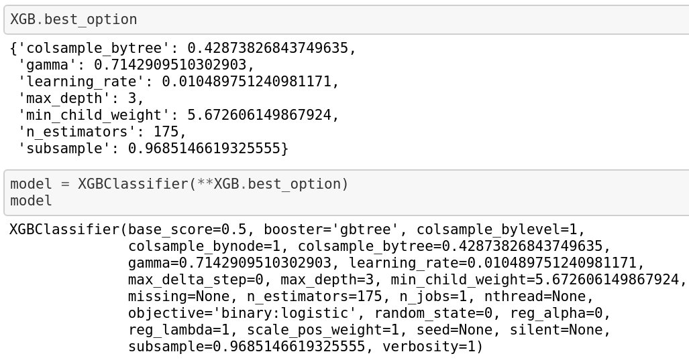

### Train the meta-learner

Finally, we train our meta-learner with the new-found “best” hyper-parameters.

```python
from sklearn.metrics import accuracy_score
def get_accuracy(model):
#     print(f'the model is {model}\n')
    model.fit(train_df,train_y[0])
    preds = model.predict(valid_df)
    
    return accuracy_score(preds, ground_truth)
```

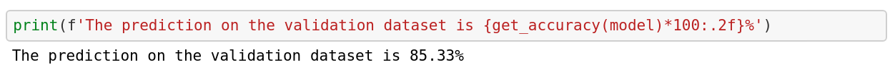

As we expected, the meta-learner has a better performance than any of our base-models.

## Compute the ROC_AUC

Lastly, in order to compare to the methods of the participant in the competition, we need to compute the `roc_auc_score` with `sklearn` and then plot out the graph:

```python
from itertools import cycle
from sklearn.multiclass import OneVsRestClassifier
from scipy import interp
from sklearn.metrics import roc_curve, auc

# Compute ROC curve and ROC area for each class
fpr = dict()
tpr = dict()
roc_auc = dict()
for i in range(data.c):
    fpr[i], tpr[i], _ = roc_curve(train_y_np[:,i], preds_np[:,i])
    roc_auc[i] = auc(fpr[i], tpr[i])
# Compute micro-average ROC curve and ROC are
fpr["micro"], tpr["micro"], _ =roc_curve(train_y_np.ravel(), preds_np.ravel())
roc_auc["micro"] = auc(fpr["micro"], tpr["micro"])
```

```python
# Compute macro-average ROC curve and ROC area
lw = 2
# First aggregate all false positive rates
all_fpr = np.unique(np.concatenate([fpr[i] for i in range(data.c)]))

# Then interpolate all ROC curves at this points
mean_tpr = np.zeros_like(all_fpr)
for i in range(3):
    mean_tpr += interp(all_fpr, fpr[i], tpr[i])

# Finally average it and compute AUC
mean_tpr /= data.c

fpr["macro"] = all_fpr
tpr["macro"] = mean_tpr
roc_auc["macro"] = auc(fpr["macro"], tpr["macro"])
for i in range(3):
    print(f"Category {i+1} Score: {roc_auc[i]:0.2f}")

# Plot all ROC curves
plt.figure()
plt.plot(fpr["micro"], tpr["micro"],
         label='micro-average ROC curve (area = {0:0.2f})'
               ''.format(roc_auc["micro"]),
         color='deeppink', linestyle=':', linewidth=4)

plt.plot(fpr["macro"], tpr["macro"],
         label='macro-average ROC curve (area = {0:0.2f})'
               ''.format(roc_auc["macro"]),
         color='navy', linestyle=':', linewidth=4)

colors = cycle(['aqua', 'darkorange', 'cornflowerblue'])
for i, color in zip(range(3), colors):
    plt.plot(fpr[i], tpr[i], color=color, lw=lw,
             label='ROC curve of class {0} (area = {1:0.2f})'
             ''.format(i+1, roc_auc[i]))

plt.plot([0, 1], [0, 1], 'k--', lw=lw)
plt.xlim([0.0, 1.0])
plt.ylim([0.0, 1.05])
plt.xlabel('False Positive Rate')
plt.ylabel('True Positive Rate')
plt.title('Receiver operating characteristic curve for 3 categories')
plt.legend(loc="lower right")
plt.show()
```

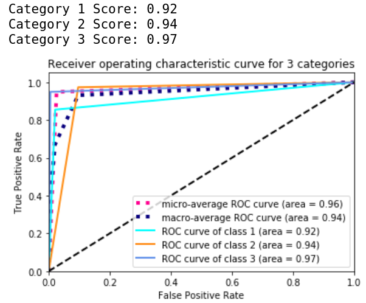

There we have it.